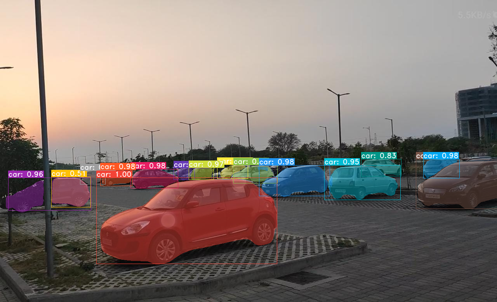
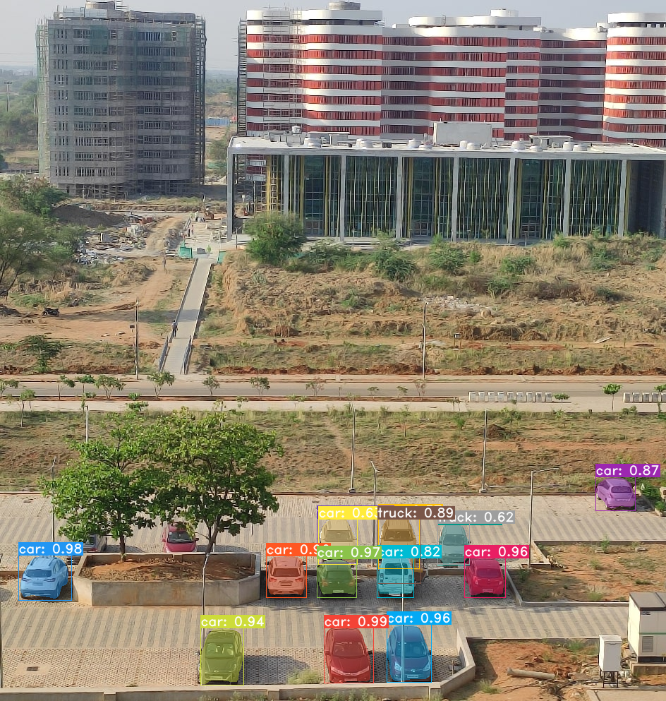
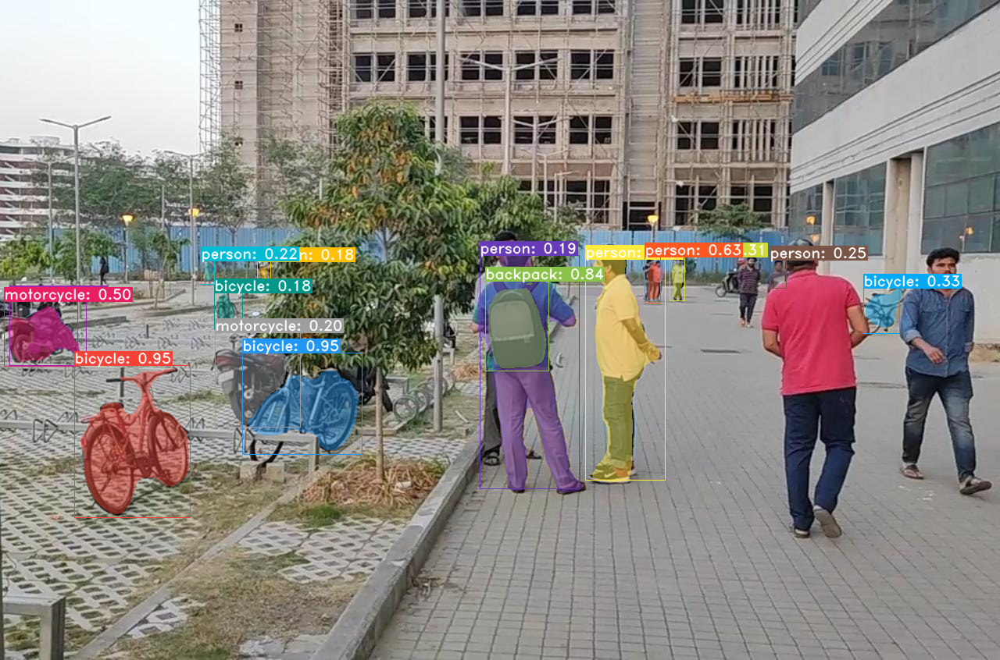
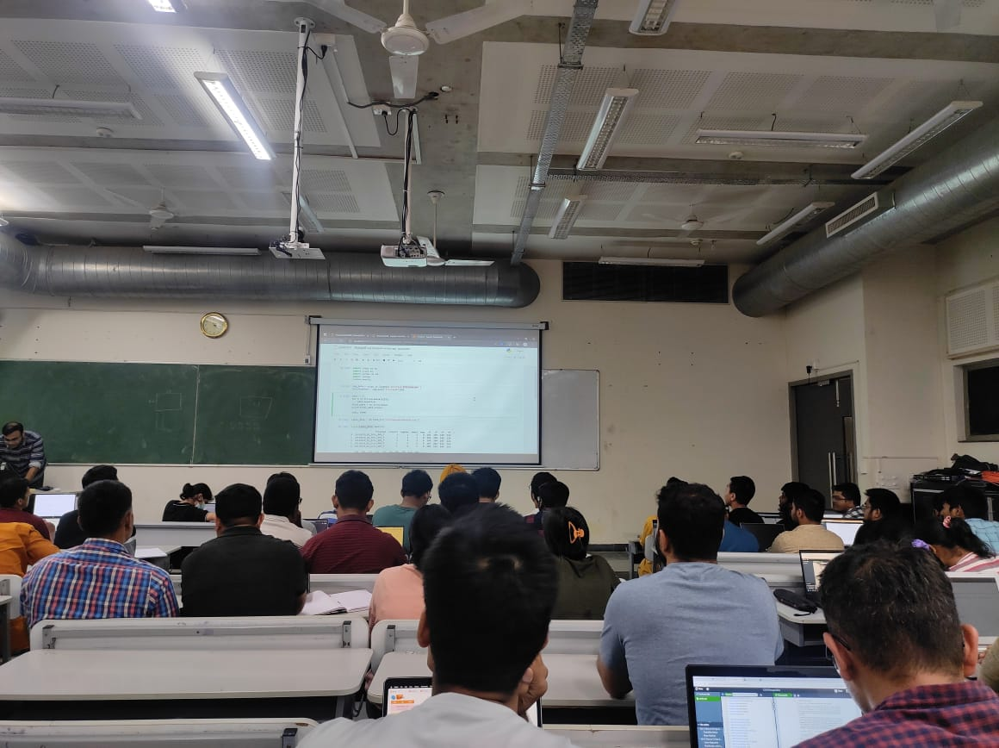
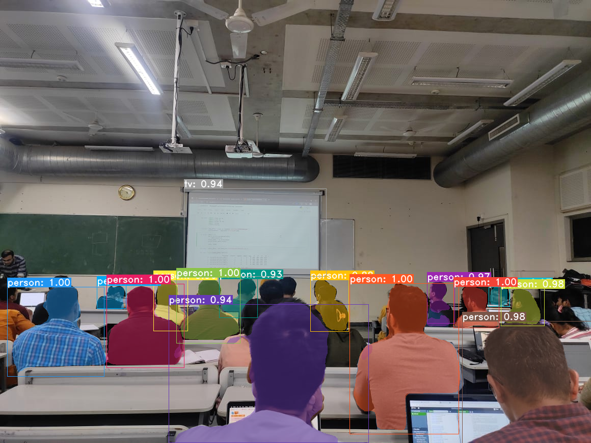

# Webcam Segmentation Application

This repository implements an image segmentation application using the YOLACT model. We leverage the power of the YOLACT model's yolact_base architecture for real-time instance segmentation. YOLACT is a state-of-the-art model known for its accuracy and efficiency in segmenting objects within images. With this application, you can perform live segmentation on images and video feeds, making it suitable for a wide range of computer vision tasks.

This repository contains code for a real-time webcam segmentation application. Follow the instructions below to set up the environment, install dependencies, and run the application.

# Image Comparison eval mode

<div align="center">
  
  
  
</div>
<div align="center">
  
  
</div>

# Comparison live webcam


## Prerequisites

Before you dive into the exciting world of real-time segmentation, ensure that you have the following prerequisites in place:

- NVIDIA GPU with CUDA support (for GPU acceleration)
- [Conda](https://docs.conda.io/en/latest/miniconda.html) installed
- Jupyter Notebook
- python  >3.8 <3.10
- Download [pretrained_model](https://drive.google.com/file/d/1UYy3dMapbH1BnmtZU4WH1zbYgOzzHHf_/view) and put in /model directory

## Installation
Let's set up your environment, install necessary dependencies, and get everything ready to roll.

1. Clone this repository:
   
```bash
   git clone https://github.com/deepak1h/webcamSegmentation.git
   cd webcamSegmentation
```
2. Create a Conda environment (replace webcam_segmentation_env with your preferred environment name):

```bash
    conda create -n webcam_segmentation_env python=3.8
```
3. Activate the Conda environment:

```bash
    conda activate webcam_segmentation_env
```
4. Install the required dependencies:

```bash
    pip install -r segmentation_requirements.txt
```

5. Setting Up CUDA
Ensure you have CUDA installed on your system for GPU acceleration. Refer to NVIDIA's CUDA Toolkit Installation [Guide]([https://www.openai.com/](https://docs.nvidia.com/cuda/cuda-installation-guide-linux/index.html)) for instructions.
```bash
    pip3 install torch torchvision torchaudio --index-url https://download.pytorch.org/whl/cu118
```

##Usage
Now that your environment is set up, let's explore how to run the application.
##Running the Application Using Python

1. Activate the Conda environment if not already activated:

```bash
    conda activate webcam_segmentation_env
```
2. Run the application using Python:

```bash
    python segmentation.py
```
3. Press the 'q' key to exit the application.

##Running the Application Using Jupyter Notebook

1. Activate the Conda environment if not already activated:

```bash
    conda activate webcam_segmentation_env
```
2. Start a Jupyter Notebook server:

```bash
jupyter notebook
```
3. Open the webcam_segmentation.ipynb notebook.

4. Run the notebook cells to execute the application.

##Acknowledgments
We would like to express our gratitude to the YOLACT team for providing the instance segmentation model that powers this application.
